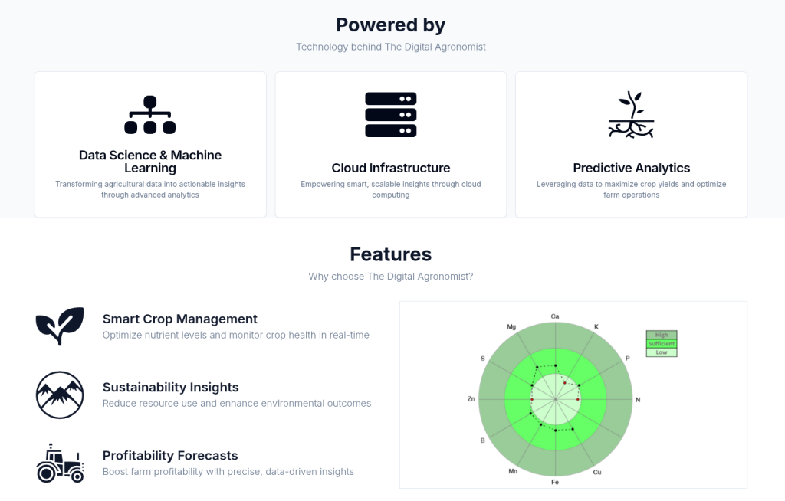
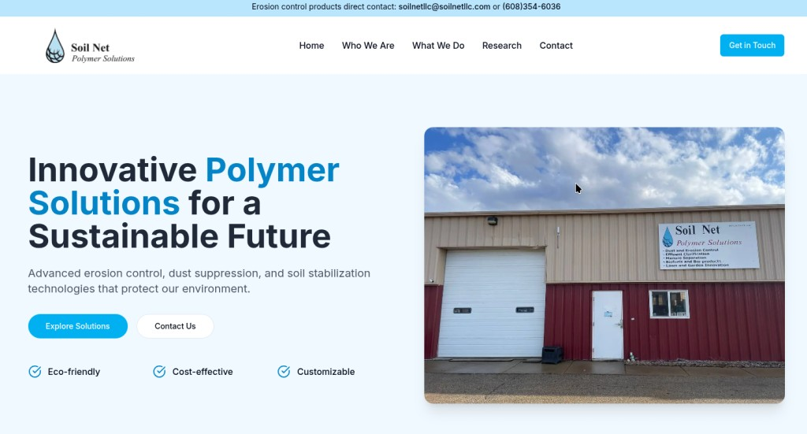
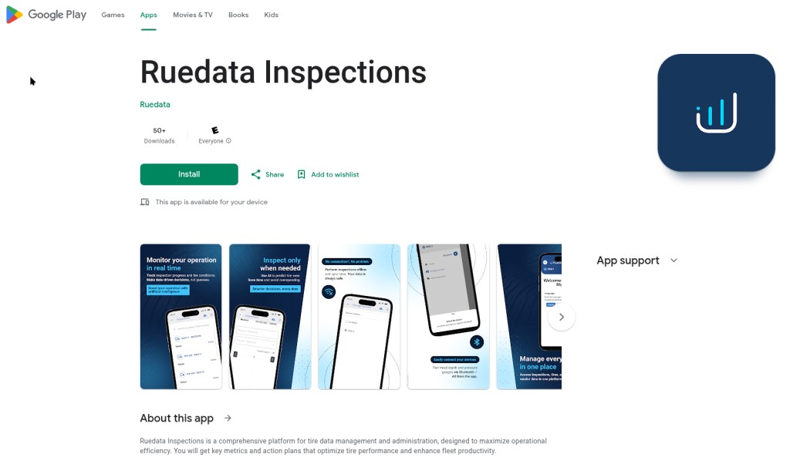
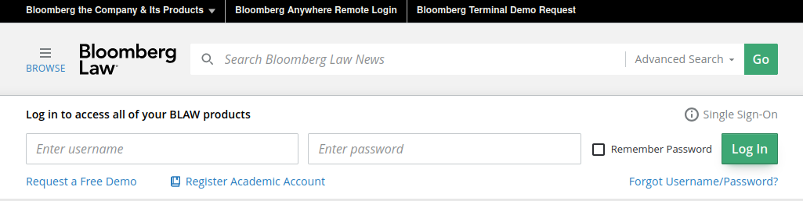
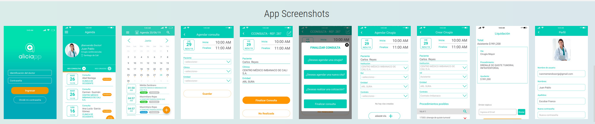
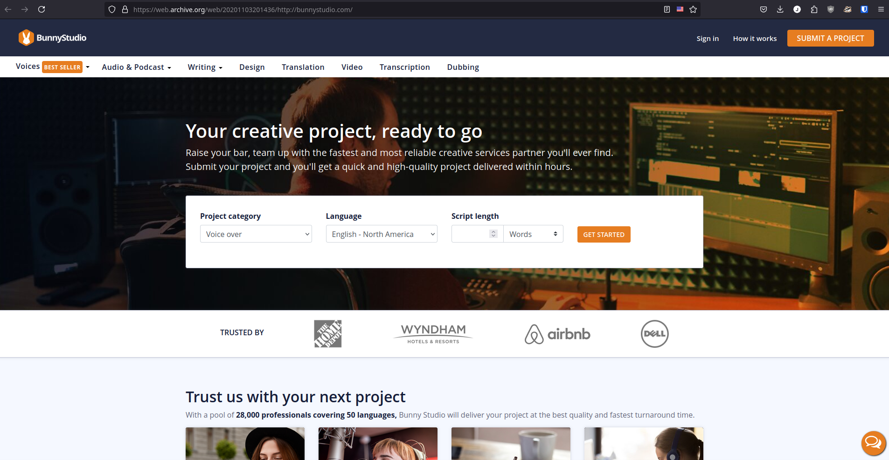
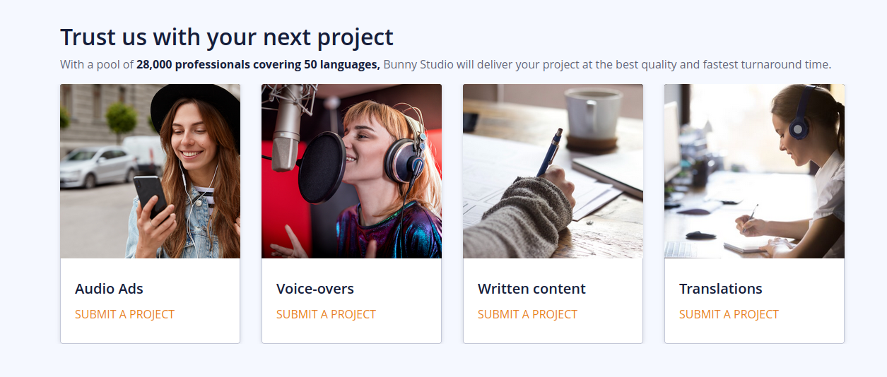
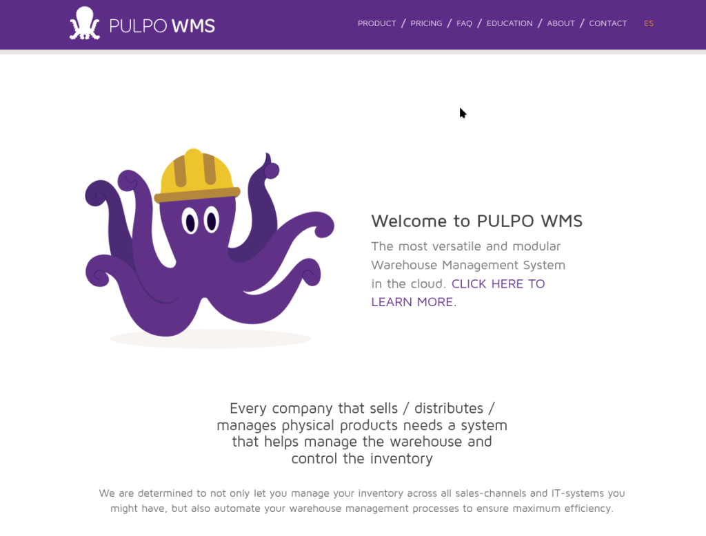

# Juan David Roa Valencia - Web Development / Frontend Portfolio

## This is a WIP (Work In Progress)—less than 20% of the portfolio. Most projects are private, so I need permission from past employers in most cases!

## Introduction

I am a Full-Stack Web Developer with over nine years of experience in creating high-performance web applications and components. My work includes developing user-friendly interfaces and optimizing web applications for speed and scalability. Below is a selection of my web development projects, including archived web pages and GitHub repositories that showcase my expertise in HTML, CSS, JavaScript, React, Node.js, Python, and more.

### Note

This portfolio highlights my work across various companies, contributions to open-source projects, and involvement in community meetups and workshops in ReactJS, JavaScript, and Ruby. I am continuously updating this portfolio as I retrieve more information from archived websites.

[Online GIT version](https://github.com/roadev/work-contributions-showcase)

## Table of Contents

- [Juan David Roa Valencia - Web Development Portfolio](#juan-david-roa-valencia---web-development-portfolio)
  - [Introduction](#introduction)
    - [Note](#note)
  - [Table of Contents](#table-of-contents)
  - [The Digital Agronomist](#the-digital-agronomist)
  - [Soil Net LLC new website](#soil-net-llc-website)
  - [Ruedata Inspections Android App - React Native)](#ruedata-inc)
  - [Bloomberg Industry Group (2021)](#bloomberg-industry-group-2021)
  - [Aliciapp.co (Archived)](#aliciappco-archived)
  - [Bunny Studio Project (Archived)](#bunny-studio-project-archived)
  - [Pulpo WMS](#pulpo-wms-2016)
  - [NASA Image Gallery (GitHub)](#nasa-image-gallery-github)
  - [React Workshop (GitHub)](#react-workshop-github)
  - [Contributions to Open-Source Projects: React Native Prompt Android (GitHub)](#contributions-to-open-source-projects-react-native-prompt-android-github)
  - [React Native Customized Boilerplate (GitHub)](#react-native-customized-boilerplate-github)
  - [Digital Flexometer: Ruby + JavaScript + Arduino (GitHub)](#digital-flexometer-ruby--javascript--arduino-github)
  - [Conclusion](#conclusion)

---

## The Digital Agronomist

Landing page for the Digital Agronomist in **Nextjs**.

[Digital Agronomist website](https://agronomist.digital/)

## Soil Net LLC website

New website for Soil Net, Server Side Rendering, latest and high performance web technology in **Nextjs, SanityCMS**.

[Soil Net LLC new website](https://soilnetllc-frontend.vercel.app/)

## Ruedata Inc

Ruedata Inspections published on Google Playstore, developed using **React Native**.

Please take a look at the app (you can install it) and the screenshots at:

[https://play.google.com/store/apps/details?id=com.ruedata.ruelitemobile&hl=en-US](https://play.google.com/store/apps/details?id=com.ruedata.ruelitemobile&hl=en-US)

## Bloomberg Industry Group (2021)

BloombergLaw and BloombergTax Login component, developed using **Web Components API**.

**Archived Version:**
[View the archived main page (2021)](https://web.archive.org/web/20211001160121/https://news.bloomberglaw.com/?target=https%3A%2F%2Fwsauth.bna.com%2Fwsauth%2Fblawauth%3Ftarget%3Dhttps%253A%252F%252Fwww.bloomberglaw.com%252Fstart%26v%3D0.1248.1)

## Aliciapp.co (Archived)

[Aliciapp.co WebApp Full Showcase](https://www.youtube.com/@aliciapp605/videos)

The WebApp was developed in **Angular** with **TypeScript** and **RxJS** using a custom web design by the owner.

Screenshots of Aliciapp after implementing the mockups for Android and iOS using **React Native** with **TypeScript**.

[Aliciapp.co app details](https://appadvice.com/app/aliciapp/1484413692)

## Bunny Studio Project (Archived)

**Description:**
Worked on several key components for the Bunny Studio website, including dynamic carousels, audio players, and media interaction components. These components were built using **React**, **Styled Components**, and **JSS**.

**Archived Version:**
[View the archived main page (2020)](https://web.archive.org/web/20201103201436/http://bunnystudio.com/)
[View the archived Bunny Studio Voice service (2020)](https://web.archive.org/web/20200813015000mp_/https://bunnystudio.com/voice/)

**Technologies Used:**
- React with Server Side Rendering (NextJS)
- Styled Components
- Microservices architecture via API calls using the browser's FETCH API
- JSS

**Key Components Developed:**
- **Dynamic Carousels:** Created responsive and interactive carousels to showcase client testimonials and services.
- **Media Interaction Components:** Developed audio players and other media components to enhance user engagement.
- **Reusable UI Cards:** Built reusable UI cards for presenting various content types, from voice samples to service details.

**Screenshots:**

Home page

Basic carousel. React component reused to work and fit at least 20 different use cases, carefully crafted by User Stories with the stakeholders.

Some implementations with more complex internal components such as the voice-overs and their sample work used the same root component. Other sections and services use different media (video, image).

---

## Pulpo WMS (Archived - 2016)

Website of Pulpo WMS (Warehouse Management System) **RAW HTML5, CSS, ES2015+**.

[Pulpo WMS 2016 version](https://web.archive.org/web/20170514140440/http://www.pulpowms.com/whats-a-wms/)

## NASA Image Gallery (GitHub)

**Description:**
A React-based application that allows users to search and view images from NASA's public API. The project demonstrates server-side rendering (SSR) and advanced state management with Redux.

**Repository:** [NASA Image Gallery on GitHub](https://github.com/roadev/nasa-image-galley)

**Technologies Used:**
- React
- Redux
- Styled Components
- Express

**Key Features:**
- **Server-Side Rendering (SSR) using RAW Express:** Improved page load times and SEO.
- **Dynamic Search:** Implemented a dynamic search feature using NASA's public API.

---

## React Workshop (GitHub)

**Description:**
A practical React workshop project to demonstrate the creation of a complete front-end application using React and popular libraries. This was part of a Workshop I presented for the Google Developers Community in Cali, Colombia.

**Repository:** [React Workshop on GitHub](https://github.com/roadev/react-workshop)

**Technologies Used:**
- React
- Redux
- CSS Modules

**Key Features:**
- Comprehensive examples of component-based architecture.
- Demonstrates best practices for state management using Redux.
- MIT License

---

## Contributions to Open-Source Projects: React Native Prompt Android (GitHub)

**Description:**
One of the many contributions I have made to **real-world** libraries and **open-source** libraries. In this case, an **NPM** Library used in many production **React Native** products.

**Repository:** [Pull Request merged on GitHub](https://github.com/shimohq/react-native-prompt-android/pull/15/files)

**Technologies Used:**
- React Native
- Android
- Facebook's Watchman

**Key Features:**
- Extending usage features.

---

## React Native Customized Boilerplate (GitHub)

**Description:**
A custom boilerplate for production projects that I created for the React Native courses and general open-source usage.

**Technologies Used:**
- Redux
- Router Flux
- ImmutableJS (for fast data structure manipulations)
- Ramda
- REST API
- MIT License, free for use including commercial purposes

**Repository:** [React Native Customized Boilerplate on GitHub](https://github.com/roadev/react-native-boilerplate)

---

## Digital Flexometer: Ruby + JavaScript + Arduino (GitHub)

**Description:**
A versatile project showcasing skills in digital measurement tools, including a web interface for interaction.

**Repository:** [Digital Flexometer on GitHub](https://github.com/roadev/digital_flexometer)

**Technologies Used:**
- AngularJS and JQuery
- Ruby (backend)
- REST APIs

**Key Features:**
- Customizable web interface for data visualization.
- Integration with hardware sensors for real-time data display.

---

## Conclusion

The above projects demonstrate my experience in front-end web development, component creation, and web optimization techniques. I am excited about the opportunity to bring my skills to the University of Wisconsin-Madison as a Front-End Web Developer and look forward to the possibility of discussing how I can contribute to your team.

**Contact Information:**
[LinkedIn](https://linkedin.com/in/roadev) | [GitHub](https://github.com/roadev) | [Email](mailto:hello@juanroa.dev)

---
